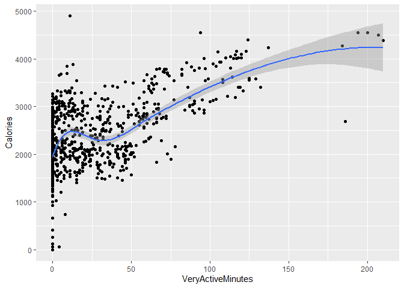
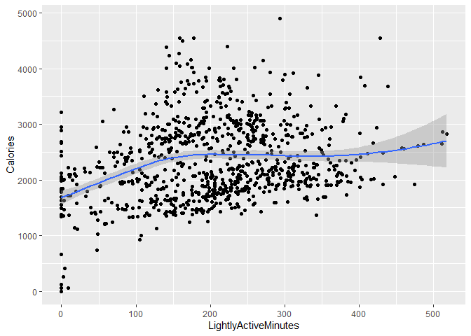
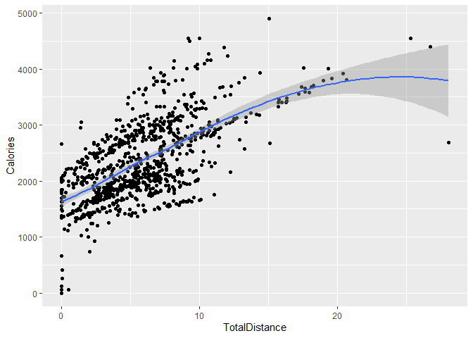
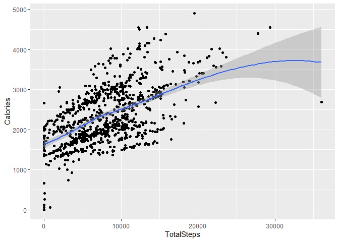

Case Study - bellabeat
================
Paula Bailey
2022-10-13

# Background

This is a case study for bellabeat, a high-tech manufacturer of
health-focused products for women. Since it was founded in 2013, the
company has been growing their e-commerce channel on their
[website.](https://bellabeat.com/) The company offers five products:
app, leaf wellness tracker, time wellness watch, spring water bottle,
and subscription based membership.

For this project, I will analyze smart device usage to gain insight into
how consumers use non-bellabeat smart devices. Afterwards we will select
one bellabeat product to address the following questions:

1.  What are some trends in smart device usage?
2.  How could these trends apply to Bellabeat customers?
3.  How could these trends help influence Bellabeat marketing strategy?

And produce a report with the following deliverables:

1.  A clear summary of the business task
2.  A description of all data sources used
3.  Documentation of any cleaning or manipulation of data
4.  A summary of your analysis
5.  Supporting visualizations and key findings
6.  Your top high-level content recommendations based on your analysis

# Ask

1.  What are some trends in smart device usage?
2.  How could these trends apply to Bellabeat customers?
3.  How could these trends help influence Bellabeat marketing strategy?

Business Task: Based on current trends in smart device usage, how to
market to bellabeat’s customer.

# Prepare

We used the [FitBit Fitness Tracker
Data](https://www.kaggle.com/datasets/arashnic/fitbit) CCO: Public
Domain, made available through
[Mobius.](https://www.kaggle.com/arashnic%22) This Kaggle data set
contains personal fitness tracker information from 30 fitbit users.
These users consented to participating in the project. The tracking data
include minute-level output for physical activity, heart rate, and sleep
monitoring.

The data is stored on Kaggle as a zip file. It contained eighteen csv
files. Thirteen are in a long format and five in wide format. The data
is credible. It is provided by a Healthcare data scientist in Australia
who contributes to the Kaggle platform. It has been used and cited by
other participants. It is also an open-data which is available to anyone
to use. There are several drawbacks. The first is the data is not
current; however, it does meet the other best practices as being
reliable, original, comprehensive, and cited. The other draw back is
some of the files have under thirty observations.

After downloading the zip file and extracting the dataset, I made a copy
of the folder in order to maintain the original data.

We checked BigQuery’s public data base for any current (or recent) data
sets on women using smart devices. I was unable to locate a proxy data
set, so I will continue with this data set.

To complete the project, I used 5 of the 18 csv files. Many of the files
contained data stored in a different csv file. Below is a description:

`dailyActivity_merged` File is in long format 15x940. The variables are
Id, ActivityDate, TotalSteps, TotalDistance, TrackerDistance,
LoggedActivitiesDistance, VeryActiveDistance, ModeratelyActiveDistance,
LightActiveDistance, SedentaryActiveDistance, VeryActiveMinutes,
FairlyActiveMinutes, LightlyActiveMinutes, SedentaryMinutes, and
Calories. This file has no missing “blank” cell. It has date format and
seems to be complete.

`dailyCalories_merged` File is in long format 3 x 940. The variables are
Id, ActivityDay, and Calories. This file has no missing “blank” cell. It
has date format and seems to be complete.

`dailyIntensities_merged` The file is in long format 10 x 940. The
variables are Id, ActivityDay, SedentaryMinutes, LightlyActiveMinutes,
FairlyActiveMinutes, VeryActiveMinutes, SedentaryActiveDistance,
LightActiveDistance, ModeratelyActiveDistance, and VeryActiveDistance.
There are no data for columns `LoggedActivitiesDistance` and
`SedentaryActiveDistance`. This file has no missing “blank” cell. It has
date format. The file seems to be complete.

`sleepDay_merged` The variables are Id, SleepDay, TotalSleepRecords,
TotalMinutesAsleep, and TotalTimeInBed. This file has no missing “blank”
cell. The date is in datetime format and needs to be formatted. The data
frame is 5 x 412, so we do not have data for every participant.

`weightLogInfo_merged` The variables are Id, Date, WeightKg,
WeightPounds, Fa, BMI, IsManualReport, and LogId. This file has no
missing “blank” cell. The date is in datetime format and needs to be
formatted. We are missing most of the information in the Fat columns.
The data frame is 8 x 67, so we do not have data for every participant.

The remaining files were not used: dailySteps_merged,
heartrate_seconds_merged, hourlyCalories_merged,
hourlyIntensities_merged, hourlySteps_merged,
minuteCaloriesNarrow_merged, minuteCaloriesWide_merged,
minuteIntensitiesWide_merged, minuteMETSNarrow_merged,
minuteStepsNarrow_merged, hourlyIntensities_merged and
minuteStepsWide_merged.

# Process

To process these data sets, I will be R programming language. It will
allow me to check for missing values, verify the dates are in the
correct format, analyze the data, and create visualizations.

There are a couple of concerns: there are participants with less than
1000 calories. I may need to consider those observations as incomplete
and remove them…but I prefer not. The metadata for the page is no longer
available, so we will document my concerns. It is possible that
participants are fasting or more likely failed to update the app.
However the goal is to determine how users are using smart devices, so
we are not going to focus so much on this issue. The other concerns is
sample size and we don’t have key characteristics - gender (we are lead
to believe the participants are female, but we do not know for sure) and
age.

`dailyActivity_merged` No out of range dates, but need to address
formatting to be consistent if used.

`dailyCalories_merged` No out of range dates, but need to address
formatting to be consistent if used.

`dailyIntensity_merged` No out of range dates, but need to address
formatting to be consistent if used.

`sleepDay_merged` No out of range dates, but need to address formatting
to be consistent if used..

`weightLogInfo_merged` No out of range dates, but need to address
formatting to be consistent if used.. Missing most of fat percentage;
only 2 recorded. Only 8 ppts participated. We can not use this
information to make reliable recommendations

We have checked all files to make sure there is no missing data. We also
verified that the dates are within the correct rate and format.

## Import

To track the cleaning process, it will be noted in this RMarkdown
document and in a README.doc saved in the project directory.

``` r
#remove blank columns
dailyActivity  <- read.csv("dailyActivity_merged_pmb.csv")%>% select(-LoggedActivitiesDistance, -SedentaryActiveDistance)

minuteMET <- read.csv("minuteMETsNarrow_merged_pmb.csv")
dailyIntensity <- read.csv("dailyIntensities_merged_pmb.csv")
dailySleep     <- read.csv("sleepDay_merged_pmb.csv")
dailySteps <- read.csv("dailySteps_merged_pmb.csv")
dailyCalories  <- read.csv("dailyCalories_merged_pmb.csv")
weightLog    <- read.csv("weightLogInfo_merged_pmb.csv")
hearrateSec <- read.csv("heartrate_seconds_merged_pmb.csv")
```

Checked to see if we have any missing values.

``` r
cbind(
   lapply(
     lapply(weightLog, is.na)
     , sum)
   )
```

    ##                [,1]
    ## Id             0   
    ## Date           0   
    ## WeightKg       0   
    ## WeightPounds   0   
    ## Fat            65  
    ## BMI            0   
    ## IsManualReport 0   
    ## LogId          0

After checking all the files, only weightLog is missing values.

Checked the structure and columns of all csv files. I verified if the
column names were consistent and reviewed the type for each variable.

``` r
str(dailyActivity)
```

    ## 'data.frame':    940 obs. of  13 variables:
    ##  $ Id                      : num  1.5e+09 1.5e+09 1.5e+09 1.5e+09 1.5e+09 ...
    ##  $ ActivityDate            : chr  "4/12/2016" "4/13/2016" "4/14/2016" "4/15/2016" ...
    ##  $ TotalSteps              : int  13162 10735 10460 9762 12669 9705 13019 15506 10544 9819 ...
    ##  $ TotalDistance           : num  8.5 6.97 6.74 6.28 8.16 ...
    ##  $ TrackerDistance         : num  8.5 6.97 6.74 6.28 8.16 ...
    ##  $ VeryActiveDistance      : num  1.88 1.57 2.44 2.14 2.71 ...
    ##  $ ModeratelyActiveDistance: num  0.55 0.69 0.4 1.26 0.41 ...
    ##  $ LightActiveDistance     : num  6.06 4.71 3.91 2.83 5.04 ...
    ##  $ VeryActiveMinutes       : int  25 21 30 29 36 38 42 50 28 19 ...
    ##  $ FairlyActiveMinutes     : int  13 19 11 34 10 20 16 31 12 8 ...
    ##  $ LightlyActiveMinutes    : int  328 217 181 209 221 164 233 264 205 211 ...
    ##  $ SedentaryMinutes        : int  728 776 1218 726 773 539 1149 775 818 838 ...
    ##  $ Calories                : int  1985 1797 1776 1745 1863 1728 1921 2035 1786 1775 ...

``` r
head(dailyActivity)
```

    ##           Id ActivityDate TotalSteps TotalDistance TrackerDistance VeryActiveDistance
    ## 1 1503960366    4/12/2016      13162          8.50            8.50               1.88
    ## 2 1503960366    4/13/2016      10735          6.97            6.97               1.57
    ## 3 1503960366    4/14/2016      10460          6.74            6.74               2.44
    ## 4 1503960366    4/15/2016       9762          6.28            6.28               2.14
    ## 5 1503960366    4/16/2016      12669          8.16            8.16               2.71
    ## 6 1503960366    4/17/2016       9705          6.48            6.48               3.19
    ##   ModeratelyActiveDistance LightActiveDistance VeryActiveMinutes FairlyActiveMinutes LightlyActiveMinutes
    ## 1                     0.55                6.06                25                  13                  328
    ## 2                     0.69                4.71                21                  19                  217
    ## 3                     0.40                3.91                30                  11                  181
    ## 4                     1.26                2.83                29                  34                  209
    ## 5                     0.41                5.04                36                  10                  221
    ## 6                     0.78                2.51                38                  20                  164
    ##   SedentaryMinutes Calories
    ## 1              728     1985
    ## 2              776     1797
    ## 3             1218     1776
    ## 4              726     1745
    ## 5              773     1863
    ## 6              539     1728

``` r
colnames(dailyActivity)
```

    ##  [1] "Id"                       "ActivityDate"             "TotalSteps"              
    ##  [4] "TotalDistance"            "TrackerDistance"          "VeryActiveDistance"      
    ##  [7] "ModeratelyActiveDistance" "LightActiveDistance"      "VeryActiveMinutes"       
    ## [10] "FairlyActiveMinutes"      "LightlyActiveMinutes"     "SedentaryMinutes"        
    ## [13] "Calories"

Notes:

-   We notice all 8 csv files contain ID, so it is possible merge or
    join them together if necessary. dailyActivity, dailyCalories, and
    dailyIntensity all contain 940 observation.  
-   Observed dailyCalories and dailyIntensity are contained within the
    dailyActivity. So, we can remove dailyCalories and dailyIntensity
    from the analysis.
-   For the project, I am only looking at dailyActivity, minuteMET,
    dailySleep, dailySteps, hearrateSec, and weightLog.

# Analyze

Now I will complete some numerical analysis on the data. First, we need
to determine if we have a minimum 30 users in each csv file. We were
told there were 30 users but we need to verify. Visually, I noticed
dailySleep and weightLog may be a problem.

``` r
n_distinct(dailyActivity$Id)
```

    ## [1] 33

``` r
n_distinct(dailySleep$Id)
```

    ## [1] 24

``` r
n_distinct(weightLog$Id)
```

    ## [1] 8

``` r
n_distinct(hearrateSec$Id)
```

    ## [1] 14

``` r
n_distinct(minuteMET$Id)
```

    ## [1] 33

``` r
n_distinct(dailySteps$Id)
```

    ## [1] 33

dailyActivity, minuteMET, and dailySteps all have 33 users. As
suspected, weight only has 8 users and dailySleep csv only has 24. The
data from either of these data frames will not be meaningful and we can
not make any conclusions.

Next, let’s look at summary statistics using dailyActivity, minuteMET,
and dailySteps files.

``` r
dailyActivity %>% select(TotalSteps, TotalDistance, SedentaryMinutes, Calories) %>% summary()
```

    ##    TotalSteps    TotalDistance    SedentaryMinutes    Calories   
    ##  Min.   :    0   Min.   : 0.000   Min.   :   0.0   Min.   :   0  
    ##  1st Qu.: 3790   1st Qu.: 2.620   1st Qu.: 729.8   1st Qu.:1828  
    ##  Median : 7406   Median : 5.245   Median :1057.5   Median :2134  
    ##  Mean   : 7638   Mean   : 5.490   Mean   : 991.2   Mean   :2304  
    ##  3rd Qu.:10727   3rd Qu.: 7.713   3rd Qu.:1229.5   3rd Qu.:2793  
    ##  Max.   :36019   Max.   :28.030   Max.   :1440.0   Max.   :4900

The average number of steps is 7,638. This is slightly above the current
guideline according to the NIH. “Researchers found that older women who
took 4,400 steps a day had a lower risk of dying than those taking 2,700
steps a day. Death rates declined with more steps taken each day until
about 7,500 steps a day, when the benefit leveled off. The findings
suggest that some people may benefit from starting with goals of fewer
than 10,000 steps a day, which is a common standard.”

Although the average number of steps is within the goal, bellabeat can
focus on users below the recommended goal of 7,500. bellabeat should not
discourage users above 7,500 - just focus on the other users. Links to
[Steps to better
Health](https://www.nih.gov/news-events/nih-research-matters/how-many-steps-better-health)
and [Step
Intensity](https://www.nih.gov/news-events/nih-research-matters/number-steps-day-more-important-step-intensity)

The summary also shows users are burning 2,304 calories per day. Since I
am unable to verify the definition of calories, I’ve made an assumption
that it’s calories burned and not consumed. This number is good, but
USDA recommends that you need to burn 3,500 calories to lose [one pound
of
weight.](https://www.nal.usda.gov/legacy/fnic/i-want-lose-pound-weight-how-many-calories-do-i-need-burn)
This gives us an opportunity to improve the lives of our users with a
reminder.

Also note, users are averaging 991.2 minutes or 16.52 hours of
sedimentary time per day. This is too low and an opportunity for
encouragement.

Bellabeat devices can be used to assist users with staying on track with
their fitness health. A reminder so users can meet the minimum goal of
7,500 steps and reducing sedimentary time. By burning more calories, the
users will lose weight, if that is their goal.

``` r
dailyActivity %>% select(VeryActiveMinutes, FairlyActiveMinutes, LightlyActiveMinutes) %>% summary()
```

    ##  VeryActiveMinutes FairlyActiveMinutes LightlyActiveMinutes
    ##  Min.   :  0.00    Min.   :  0.00      Min.   :  0.0       
    ##  1st Qu.:  0.00    1st Qu.:  0.00      1st Qu.:127.0       
    ##  Median :  4.00    Median :  6.00      Median :199.0       
    ##  Mean   : 21.16    Mean   : 13.56      Mean   :192.8       
    ##  3rd Qu.: 32.00    3rd Qu.: 19.00      3rd Qu.:264.0       
    ##  Max.   :210.00    Max.   :143.00      Max.   :518.0

Most the minutes categorized are in lightly active minutes which is only
192.8 minutes or 3.2 hours.

``` r
minuteMET %>% select(METs) %>% summary() 
```

    ##       METs       
    ##  Min.   :  0.00  
    ##  1st Qu.: 10.00  
    ##  Median : 10.00  
    ##  Mean   : 14.69  
    ##  3rd Qu.: 11.00  
    ##  Max.   :157.00

The MET (metabolic equivalent of task) is the ratio of the metabolic
rate during exercise to the metabolic rate at rest. One MET can be
expressed as oxygen uptake 3.5 kcal/kg/min. The average MET for this
groups is 14.69, which seems extremely high. We will not be using this
variable for analysis.

``` r
weightLog %>% select(WeightKg, BMI)%>% summary()
```

    ##     WeightKg           BMI       
    ##  Min.   : 52.60   Min.   :21.45  
    ##  1st Qu.: 61.40   1st Qu.:23.96  
    ##  Median : 62.50   Median :24.39  
    ##  Mean   : 72.04   Mean   :25.19  
    ##  3rd Qu.: 85.05   3rd Qu.:25.56  
    ##  Max.   :133.50   Max.   :47.54

We can not use BMI because we only have 8 observations. It is worth
noting the average BMI for the group is 25.19, which according to CDC it
falls into the overweight category. The max is 47.54 which falls into
[“severe”
obesity.](https://www.cdc.gov/obesity/basics/adult-defining.html)

If your BMI is 18.5 to \<25, it falls within the healthy weight range.
If your BMI is 25.0 to \<30, it falls within the overweight range. If
your BMI is 30.0 or higher, it falls within the obesity range.

``` r
dailySleep %>% select(-TotalSleepRecords, -Id, -SleepDay, TotalMinutesAsleep, TotalTimeInBed) %>% summary()
```

    ##  TotalMinutesAsleep TotalTimeInBed 
    ##  Min.   : 58.0      Min.   : 61.0  
    ##  1st Qu.:361.0      1st Qu.:403.0  
    ##  Median :433.0      Median :463.0  
    ##  Mean   :419.5      Mean   :458.6  
    ##  3rd Qu.:490.0      3rd Qu.:526.0  
    ##  Max.   :796.0      Max.   :961.0

Our users averaged 6.99 hours of sleep and 7.64 hours in bed. This shows
while in the bed, users are sleeping most of the time.

According to the
[CDC](https://www.cdc.gov/sleep/about_sleep/how_much_sleep.html), adults
need 7 hours or more per night of sleep. The sample gets adequate levels
of sleep.

# Share

I used the dailyActivity csv to create visualizations.

``` r
ggplot(dailyActivity,aes(x=VeryActiveMinutes, y=Calories)) + geom_point() +
  geom_smooth(method = loess, formula = y~x)
```

<!-- -->

``` r
cor(dailyActivity$VeryActiveMinutes, dailyActivity$Calories)
```

    ## [1] 0.6158383

This plot shows the relationship between veryActiveMinutes and Calories.
It indicates a positive relationship. The more active a person is, the
more calories a person burns. This is also supported in the correlation
rate of .62.

``` r
ggplot(dailyActivity,aes(x=LightlyActiveMinutes, y=Calories)) + geom_point()+
  geom_smooth(method = loess, formula = y~x)
```

<!-- -->

This plot shows the relationship between LighltyActiveMinutes and
Calories. We can still see a positive increase in calories burned until
the user reaches 150 steps, then it levels off. If you compare it to the
VeryActiveMinutes above, the user has to complete more steps at lightly
active level. Actually, the user never reaches the 3,500 calorie burn to
lose the one pound. We can use this information to educate our users and
encourage them to increase their intensity.

``` r
ggplot(dailyActivity,aes(x=TotalDistance, y=Calories)) + geom_point() +
  geom_smooth(method = loess, formula = y~x)
```

<!-- -->

``` r
cor(dailyActivity$TotalDistance, dailyActivity$Calories)
```

    ## [1] 0.6449619

This plot shows the relationship between veryActiveMinutes and Calories.
As you would guess, It indicates a positive relationship and the
correlation rate of .65. We see some users (outliers) who are walking
(running) more than 20 miles and burning more than 3,500 calories. As
note, the vast majority of user are burning far less than 3,500
calories.

``` r
ggplot(dailyActivity,aes(x=TotalSteps, y=Calories)) + geom_point() +
  geom_smooth(method = loess, formula = y~x)
```

<!-- -->

``` r
cor(dailyActivity$TotalSteps, dailyActivity$Calories)
```

    ## [1] 0.5915681

Again we are seeing a relationship between fitness (total steps) and
Calories. The correlation rate of .59.

# Act

Since users are willing to provide their health information on the app,
we need to look for way to encourage ouusers to be healthier. I
recommend the following:

1.  Encourage users to reach a minimum goal of 7,500 steps. Monitor
    total step per day. Offer notification to encourage users to meet
    that goal.
2.  Encourage users to reach a minimum goal of 7 hour of sleep. Offer
    notification to encourage users to meet that goal.
3.  Encourage users to add height and weight to track BMI.
4.  Monitor Sedentary Minutes per day. If user are sedimentary for less
    than a certain period, we can offer to send notifications.
5.  if users a interested in losing weight, we can support these users
    with notifications to keep them on track
6.  Create weekly fitness and wellness challenges.
